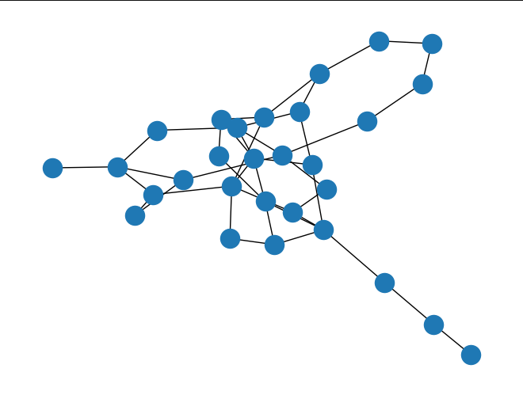
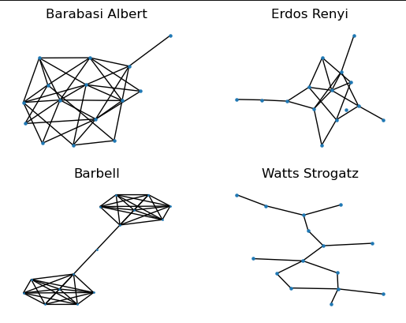

 # NetworkX Overview
 ## A Network Creation, Manipulation, and Study Package for Python 3
 ## By Gaia Noseworthy - 3554411

 ### 1. What is NetworkX?
 From its own page[1], "NetworkX is a Python package for the creation, manipulation, and study of the structure, dynamics, and functions of complex networks." Released in 2005, NetworkX provides a series of tools for the generation, management, and analysis of networks and graphs in a mathematical form.

 This leads to the obvious question of what a network is itself. Thus, taking from Dr. Levin[2], a network is some collection of objects, called nodes or vertices, which are connected by edges. When two nodes are connected by such an edge, we say they are adjacent. In essence, this means that a network is a series of single concepts, such as a person, building, or idea, and an edge is some path in which you can move between them.

 In the rest of this section, we will discuss the purpose of NetworkX, and how you might go about using it.

 #### 1a. What is NetworkX's purpose?
 To answer the first question of this document, we must discuss the purpose of this package. In general, the field of graph theory allows us to study the behaviour of various connected objects. For example, one may be curious about the shortest path between multiple houses and buildings, or how nodes may form in internet traffic (especially through popular social media platforms).

 To give a stronger example, though, let us consider epidemics. At the beginning of the COVID pandemic, it became quite popular (and necessary) to study how a disease such as COVID-19 may travel through a population. The traditional way to do this is through simple differential equations[3], but one approach is to instead generate a list of every person that someone interacts with and for roughly how long. To demonstrate, imagine a total of 4 people, of which only some interact. You could measure their interactions in a big grid where the rows and columns represent the people (in order), and the values represent the number of hours of interaction per day. We will put 0 in the diagonals, just to avoid self-interaction:
 ```
 [[0,  8,  8, 16,  16],
  [8,  0,  0,  0,   0],
  [8,  0,  0,  5,   3],
  [16, 0,  5,  0,  10],
  [16, 0,  3,  10,  0]]
 ```

 In this hypothetical model, we could guess that person 1, 2, and 3 work together, with person 1 being loosely in charge of the other two, while person 1 may be a family member of persons 4 and 5, where 4 and 5 don't have fully overlapping schedules. Then, if we were to put a disease on this network, we could guess how the disease may spread between these 5 people based on how much time they spend together. If person 1 gets sick, then everybody is at risk, but if person 2 gets sick, only person 1 is at risk.

 So, how does NetworkX come in? NetworkX allows for the generation, analysis, and modification of these exact types of networks. It provides a clean environment for one to generate a network, calculate the shortest paths between nodes or the average length of the shortest path between all node pairs, figure out how clustered it is, and to implement these hours-based weightings or even directional (one-way) graphs.

 Possibly more importantly, since NetworkX is programmed so well, it also allows for other users to build upon it, including that exact Epidemics On Networks simulation mentioned above, using a package of the same name.[4]

 All-in-all, this makes NetworkX both a powerful tool for graph theory purposes, as well as a useful framework for building upon it for the generation of even greater applications. In the next section, we will explore how one may go about using it.

 #### 1b. How do you use NetworkX?
 NetworkX provides a number of key functions, but for one to get started, they need to know of a few specific ones. In this section, we will cover
 1. Loading NetworkX
 2. Generating Simple Graphs
 3. Importing Simple Graphs
 4. Saving Graphs
 5. Modifying Graphs

 Let us begin with loading NetworkX. Like with the instructions in the ReadMe, NetworkX can be downloaded using your favourite package manager, or in Python directly using
 ```Python
 pip install networkx[default]
 ```

 Once installed, you can load NetworkX as any other package, for example
 ```Python
 import networkx as nx
 ```

 Next, you may wish to generate a simple graph to see how it functions. Using solely the most basic random graph functions, a demo random graph can be generated using
 ```Python
 g = nx.fast_gnp_random_graph(n,p)
 ```

 Where `n` and `p` both must be values where `n` is an int greater than 0 and `p` is a probability of there being an edge between any two nodes, stored as a float between 0 and 1.

 If one would like to see their graph, they could import their favourite plotting package and plot it. Using MatPLotLib as a basis, this can be done as
 ```Python
 import matplotlib.pyplot as plt
 nx.draw(g)
 plt.show()
 ```

 This will produce an image similar to the one that follows:
 

 If, instead, you prefer to import a graph, the easiest way is to use an edge list. One is provided in the ReadMe as
 ```
 0 1 {}
 0 2 {}
 0 3 {}
 0 4 {}
 0 5 {}
 0 6 {}
 0 7 {}
 0 8 {}
 1 4 {}
 2 4 {}
 2 5 {}
 2 6 {}
 2 7 {}
 2 8 {}
 3 5 {}
 3 6 {}
 4 7 {}
 4 9 {}
 5 8 {}
 5 9 {}
 6 9 {}
 ```

 Assuming this is saved as a text file, you can then load it into NetworkX using
 ```Python
 g = nx.read_edgelist(path = "path/to/network.txt", delimiter = ":")
 ```

 This will store the graph the same as in our random generator. Once you are happy with your imported graph, you may wish to save it. This can be done as
 ```Python
 nx.write_edgelist(g, path = "path/to/network.txt")
 ```

 Finally, should you wish to edit your graph, you can add and remove nodes or edges as follows:
 ```Python
 #Remove one edge
 g.remove_edge(node1, node2)

 #Remove multiple edges
 g.remove_edges_from([(node1, node2), (node3, node4), (node5, node6)])

 #Add an edge
 g.add_edge(node1, node2)

 #Remove a node
 g.remove_node(node)

 #Add a node with a string id
 g.add_node("node_id")

 #Add a node with an int id
 g.add_node(node_id)
 ```

 This provides all of the info you need for adding and removing nodes and edges from your network, as well as for using NetworkX in the most fundamental of forms. Should you wish to grow more advanced, the full documentation can be found on the NetworkX website[5].

 ### 2. What are the functionalities of NetworkX?
 In this section, we will discuss the functionalities of NetworkX in more detail. Should you wish to see the basic functionalities, please see the above sections. We will break this down into 2 major pieces: Generating unique random graphs, and performing analysis on your graphs.

 #### 2a. Graph Generation
 NetworkX provides more than just the basics for graph generation. A full list of their graph tools can be found on their website[6], but to really demonstrate this functionality, we will discuss 4 types:
 1. Barabasi-Albert Graphs
 2. Erdos-Renyi Graphs
 3. Barbell Graphs
 4. Watts-Strogatz Graphs

 Going in order, the first major type is Barabasi-Albert graphs. Defined by Barabási and Albert in 2002[7], they are otherwise known as Preferential Attachment Networks. The idea is that these networks define the average number of connections that each node should have, but then will define a few of these nodes to become "hubs", meaning they have an unusually high number of connections. These networks tend to exist in real life in the form of the Internet, citation networks, and even some social networks.

 The next type is an Erdos-Renyi graph. This was really the first major type of random network, and was developed by researchers Erdős and Rényi in 1956 who really founded the entire field of randomly-generated graphs in graph theory with their work.[8] These graphs are truly random, though the version implemented is actually the Erdos-Renyi-Gilbert model, where the user may specify a total of `n` nodes with the probability of an edge between any two nodes being defined as `p`. In many pieces of software, this is also just called a random network.

 Next up is possibly the simplest to understand: Barbell graphs.[9] A barbell graph will generate two dense graphs (all nodes connected) of size `n` each, and then will connect them using a bridge of `m` nodes. These graphs may represent real networks such as two workplaces where only 1 person in each knows each other, though the study of these graphs is limited.

 The final type is the Watts-Strogatz Graph. This is a generation algorithm known for making "small world" properties. Developed by Duncan Watts and Steven Strogatz in 1998, these graphs begin by making a perfect ring of size N, where each person is connected to their nearest K neighbours. Then, each edge has a random chance of being rewired, where it goes from `(node1, nodeOld)` to `(node1, nodeNew)`. This chance is often called beta. These networks tend to be those you see in gene networks, the Internet, and so on, and may even represent the network of connections found in real life.

 Now that you know what these graphs are, you can below find an example of their generation. Taking `n = 15`, we will set up each to look similar:
 ```Python
 #Barabasi-Albert: 3 connections per node
 ba = nx.barabasi_albert_graph(15, 3)

 #Erdos Renyi: average of 3 per node as well
 er = nx.erdos_renyi_graph(15, 3/15)

 #Barbell: bridge with 1 node between
 bb = nx.barbell_graph(7, 1)

 #Watts-Strogatz: 2 nearest neighbours (since 3 is odd), 50% chance of rewiring
 ws = nx.watts_strogatz_graph(15, 3, 0.5)
 ```

 We can then choose to display these. There are many ways to do so, and you can find them here.[11] I will use the kamada_kawai method, solely because it tends to produce the easiest to read graphs overall, though many may prefer the circular or random drawing methods. The code for this, using the same previous graphs, is
 ```Python
 fig, axs = plt.subplots(2,2)

 nx.draw_kamada_kawai(ba, ax=axs[0,0], node_size = 5)
 axs[0,0].set_title("Barabasi Albert")

 nx.draw_kamada_kawai(er, ax=axs[0,1], node_size = 5)
 axs[0,1].set_title("Erdos Renyi")

 nx.draw_kamada_kawai(bb, ax=axs[1,0], node_size = 1)
 axs[1,0].set_title("Barbell")

 nx.draw_kamada_kawai(ws, ax=axs[1,1], node_size = 5)
 axs[1,1].set_title("Watts Strogatz")

 plt.show()
 ```

 


 #### 2b. Graph Analysis
 Once you have your graphs generated, you may wish to perform analysis on them. NetworkX provides a lot of options for this, which can be found here.[12] In this case, the code produced above makes use of 4 of these, which are:
 1. Average Shortest Path Length[13] - If you were to compute the shortest path for every single pair of nodes (which would be a total of `n^2` paths), and average their lengths, this is the result you would get.
 2. Average Clustering[14] - This is the clustering coefficient, and is a general measure of to which degree nodes tend to cluster together. In real life, people tend to form close-knit groups, and this is especially true in social networks. This number specifically is how many closed triplets form (3 nodes all connected to each other) versus open triplets (one node connected to two more).
 3. Average Nodes Connectivity[15] - Connectivity is the minimum number of nodes that must be removed to disconnect any two nodes. The average for this is, on average, for any two nodes in the entire graph, how many nodes would you have to remove to disconnect them.
 4. Wiener Index[16] - The Wiener Index is the sum of all distances between all pairs of vertices in the graph.

 Now that we know what these are, how do we get them in NetworkX? Well, this is as follows:
 ```Python
 aspl = nx.average_shortest_path_length(g)
 print("Average Shortest Path Length: ", aspl)

 clus = nx.average_clustering(g)
 print("Average Clustering Coefficient: ", clus)

 conn = nx.average_node_connectivity(g)
 print("Average Node Connectivity: ", conn)

 wie = nx.wiener_index(g)
 print("Wiener Index: ", wie)
 ```

 To give an example output, for a random Watts-Strogatz graph of 30 nodes, connected to the 4 nearest neighbours, with a rewiring chance of 50%, this gives:
 ```
 Average Shortest Path Length:  2.579310344827586
 Average Clustering Coefficient:  0.32000000000000006
 Average Node Connectivity:  3.193103448275862
 Wiener Index:  1122.0
 ```

 ### 3. Why NetworkX?
 As a graph theory focused package, NetworkX provides a series of powerful tools for generating, handling, and analyzing graphs. This allows us to do some seriously important studies on societies and social networks, especially in modern CS and sociology. Possibly even more importantly, one may wish to use these networks to study the spread of disease in society, such as using EoN.[4] I did this myself, though not in NetworkX and instead using my own custom-made C library, not knowing how useful NetworkX really is.

 ### 4. Learning and Overall Experience?
 Overall, the study of NetworkX could give someone a lot of experience in file IO, matrices, dictionaries, and other core features to Python. It also carefully introduces MatPlotLib without being overwhelming, and allowed me personally to touch up on user input and error handling, all useful skills.

 Overall, NetworkX is an easy-to-use, hard-to-master package with incredible power. I would recommend it to anyone looking to first be introduced to, or to fully learn graph theory, as I will continue to do. Its power is unrivalled, and it is by far the easiest to use library I've ever seen in this field.

 ### References
 [1] Aric A. Hagberg, Daniel A. Schult and Pieter J. Swart, “Exploring network structure, dynamics, and function using NetworkX”, in Proceedings of the 7th Python in Science Conference (SciPy2008), Gäel Varoquaux, Travis Vaught, and Jarrod Millman (Eds), (Pasadena, CA USA), pp. 11–15, Aug 2008

 [2] O. Levin, "Discrete Mathematics", Open Math Books, 2013 https://discrete.openmathbooks.org/dmoi3.html

 [3] David Smith and Lang Moore, "The SIR Model for Spread of Disease - The Differential Equation Model," Convergence (December 2004)

 [4] Joel C. Miller and Tony Ting, "EoN (Epidemics on Networks): a fast, flexible Python package for simulation, analytic approximation, and analysis of epidemics on networks", arXiv, 18 Jan, 2020. https://arxiv.org/pdf/2001.02436.pdf

 [5] https://networkx.org/

 [6] https://networkx.org/documentation/stable/reference/generators.html

 [7] R. Albert and A.-L. Barabási, “Statistical mechanics of complex networks”, Reviews of Modern Physics, 74, pp. 47-97, 2002. https://arxiv.org/abs/cond-mat/0106096

 [8] P. Erdős and A. Rényi, On Random Graphs, Publ. Math. 6, 290 (1959).

 [9] [Barbell Graph](https://networkx.org/documentation/stable/reference/generated/networkx.generators.classic.barbell_graph.html)

 [10] Duncan J. Watts and Steven H. Strogatz, Collective dynamics of small-world networks, Nature, 393, pp. 440–442, 1998.

 [11] https://networkx.org/documentation/stable/reference/drawing.html

 [12] https://networkx.org/documentation/stable/reference/algorithms/index.html

 [13] [Average Shortest Path Length](https://networkx.org/documentation/stable/reference/algorithms/generated/networkx.algorithms.shortest_paths.generic.average_shortest_path_length.html)

 [14] [Average Clustering](https://networkx.org/documentation/stable/reference/algorithms/generated/networkx.algorithms.cluster.average_clustering.html#networkx.algorithms.cluster.average_clustering)

 [15] [Average Node Connectivity](https://networkx.org/documentation/stable/reference/algorithms/generated/networkx.algorithms.connectivity.connectivity.average_node_connectivity.html)

 [16] [Wiener Index](https://networkx.org/documentation/stable/reference/algorithms/generated/networkx.algorithms.wiener.wiener_index.html#networkx.algorithms.wiener.wiener_index)

 ### License
 The NetworkX License is as follows:
 > Copyright (C) 2004-2023, NetworkX Developers
> Aric Hagberg <hagberg@lanl.gov>
> Dan Schult <dschult@colgate.edu>
> Pieter Swart <swart@lanl.gov>
> All rights reserved.

> Redistribution and use in source and binary forms, with or without modification, are permitted provided that the following conditions are met:

> > * Redistributions of source code must retain the above copyright
    notice, this list of conditions and the following disclaimer.

> > Redistributions in binary form must reproduce the above
    copyright notice, this list of conditions and the following
    disclaimer in the documentation and/or other materials provided
    with the distribution.

> > Neither the name of the NetworkX Developers nor the names of its
    contributors may be used to endorse or promote products derived
    from this software without specific prior written permission.

> THIS SOFTWARE IS PROVIDED BY THE COPYRIGHT HOLDERS AND CONTRIBUTORS "AS IS" AND ANY EXPRESS OR IMPLIED WARRANTIES, INCLUDING, BUT NOT LIMITED TO, THE IMPLIED WARRANTIES OF MERCHANTABILITY AND FITNESS FOR A PARTICULAR PURPOSE ARE DISCLAIMED. IN NO EVENT SHALL THE COPYRIGHT OWNER OR CONTRIBUTORS BE LIABLE FOR ANY DIRECT, INDIRECT, INCIDENTAL, SPECIAL, EXEMPLARY, OR CONSEQUENTIAL DAMAGES (INCLUDING, BUT NOT LIMITED TO, PROCUREMENT OF SUBSTITUTE GOODS OR SERVICES; LOSS OF USE, DATA, OR PROFITS; OR BUSINESS INTERRUPTION) HOWEVER CAUSED AND ON ANY THEORY OF LIABILITY, WHETHER IN CONTRACT, STRICT LIABILITY, OR TORT (INCLUDING NEGLIGENCE OR OTHERWISE) ARISING IN ANY WAY OUT OF THE USE OF THIS SOFTWARE, EVEN IF ADVISED OF THE POSSIBILITY OF SUCH DAMAGE.
